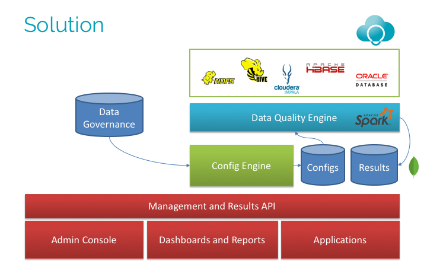

# Agile Lab Data Quality

DQ is a framework to build parallel and distributed quality checks on big data environments.
It can be used to calculate metrics and perform checks to assure quality on structured or unstructured data.
It relies entirely on Spark.

---

Data Quality framework has been developed by [Agile Lab](http://www.agilelab.it).

Compared to typical data quality products, this framework performs quality checks at raw level.
It doesn't leverage any kind of SQL abstraction like Hive or Impala because they perform type checks at runtime hiding bad formatted data.
Hadoop is mainly unstructured data (files), so we think that quality checks must be performed at row level without typed abstractions.

With DQ you are allowed to:
- Load heterogeneous data from different sources (HDFS, DB etc.) and various formats (Avro, Parquet, CSV, etc.)
- Apply SQL queries on Sources (powered with spark Dataframe API) 
- Select, define and perform metrics on DataFrames
- Compose and perform checks
- Evaluate quality and consistency on data, determined by constraints.
- Perform trend analysis, based on previous results.
- Transform results in order to make reports that you like.
- Save results on HDFS in multiple formats (csv, avro, parquet) or/and datastore etc.

## Background

Perform metrics and checks on huge data is a hard task. With DQ we want to build a flexible framework that allow to specify a formalism to make different metrics to calculate in parallel and one-pass application, and perform and store checks on data.
We use Typesafe Configuration to set workflows and Spark to ingest and perform Data Quality applications based on it.

## Architecture



The Data Quality project is divided into 2 main modules:
- **Config engine**: Web application to help your write and validate DQ configuration files.
- **Core engine**: Main module of DQ, which run the Spark Application, calculating everything defined in configuration file.
 Can be ran locally on single machine or in client mode on cluster manager (YARN). Please, note that the distributed deployment is still under development.

Data Quality is using Typesafe configuration files in order to define the logic of your applications:
 here you can specify sources to load, metrics to process on data, checks to evaluate, targets to save results and many more.
List of entities to configure:
- **Sources**: entry point to the application. Defines files and tables to process in future.
- **Virtual sources**: defines pre-processing transformations of defined sources. Uses plain SQL queries (calculated in-memory via Spark SQL api).
- **Metrics**: metrics are formula that can be applied to a table or a column. For each workflow you can define a set of metrics to process in one-pass run. Each metric return 'Double' value as the result (except the TOP_N metric).
- **Composed metrics**: additional metrics made of other metric results. Can use both metrics and other composed metrics.
- **Checks**: checks are control unit of the application, can be applied to current metric result in order to check if it fits defined constraint(greater/lesser than or equal to some constant value or other metric result). Returns "Boolean" values, which can be easily evaluated.
- **Targets**: set of files and alarms to which will be passed results of previous modules in order to save or/and notify by email. 
- **Postprocessing**: set of transformations to finalize any results and prepare reports.

**Run on cluster**, is possible via scheduled period and range on dates.

## Documentation

You can find Data Quality documentation [here](docs).
It is divided into several sections:
- [Sources](docs/sources.md)
- [Metrics](docs/metrics.md)
- [Checks](docs/checks.md)
- [Targets](docs/targets.md)
- [Postprocessors](docs/postprocessors.md)

You can improve it by sending pull requests to this repository.

## Installation

Data Quality is currently using following dependencies:
- Scala 2.10(core)/2.11(ui)
- Apache Spark 1.6
- PostgreSQL 9.3 (works also with Oracle and SQLite)

To be able to use all the features of Data Quality you'll need to setup a database
- [How to setup a database](docs/installation/database-setup.md)

All modules of DQ works independently.:
- [DQ-CORE installation guide](docs/installation/core-setup.md)
- [DQ-UI installation guide](docs/installation/ui-setup.md)


## Building CORE module

Data Quality core module can be built with 2 different versions of Spark (1.6.0, 2.2.0). By default if will select 1.6.0. In order to build with Spark 2 set Multiversion.sparkVersion as in following snippet:
```
- set Multiversion.sparkVersion := "2.2.0"
- project core
- assembly
```

## Examples

There are some examples [here](docs/examples/examples.md), but here is one to get you started:

We have the famous USGS earthquake dataset and we want to know what is an average depth per year and 
set a check if it's bigger than some constraint.

Let's start with the source! For this example we will you only one snapshot:
```hocon
Sources: [
  {
    id = "USGS_2000"
    type = "HDFS"
    path = "/PATH_TO_FILES/docs/examples/data/usgs/USGS_2000.csv"
    delimiter = ","
    header = true
    fileType = "csv"
  }
]
```
Now we can calculate our metric (mean of depth):
```hocon
Metrics: [
  {
    id: "depth_avg"
    name: "AVG_NUMBER"
    type: "COLUMN"
    description: "Average value of depth"
    config: {
      file: "USGS_2000",
      columns: ["Depth"]
    }
  }
]
```
Finally, check if metric result is bigger than 50:
```hocon
Checks: [
  {
    id: "depth_avg_check"
    type: "snapshot"
    subtype: "GREATER_THAN"
    description: "Checks is average depth is greather than 50"
    config: {
      metrics: ["depth_avg"]
      params: {threshold: "50"}
    }
  }
]
```
And we are done! Now we can run it locally or on cluster. Result will be stored in the database defined in 'application.conf'.
This is just the beginning, next we can add more metrics, checks, preprocess/postprocess our sources and
generate some reports. More information about it you can find [here](docs/examples/examples.md).

## Contributing

The main purpose of this repository is to continue to develop all modules of Data Quality, making it easier and faster to use.
Development of Data Quality happens in the open on GitHub, and we are grateful to the community for contributing bugfixes and improvements.

### License

Data Quality is [GNU GPL](LICENSE) licensed.


